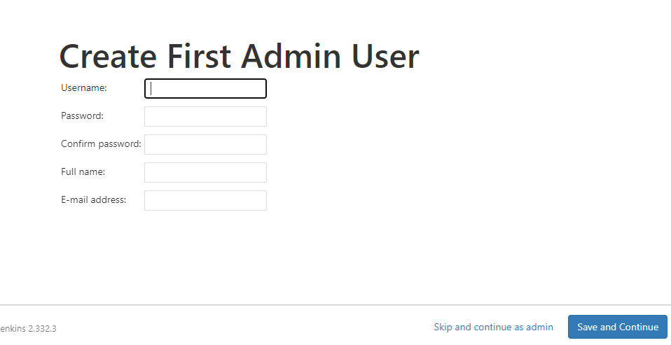
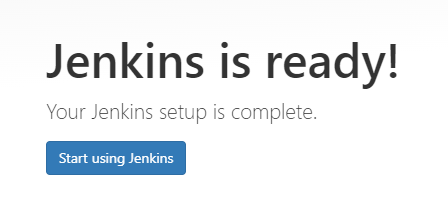
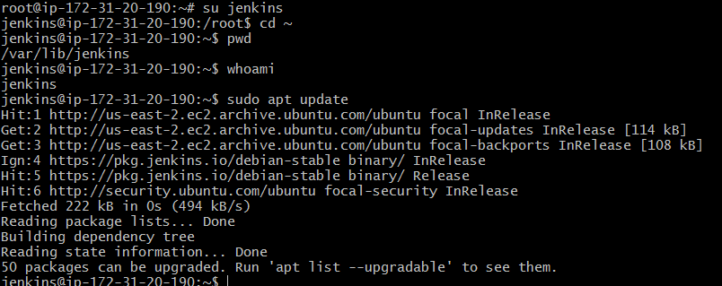
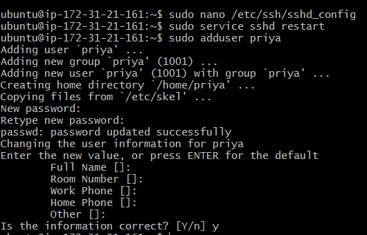
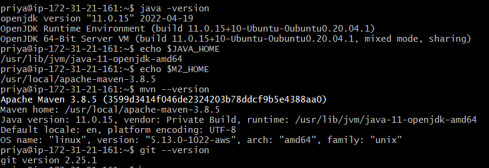
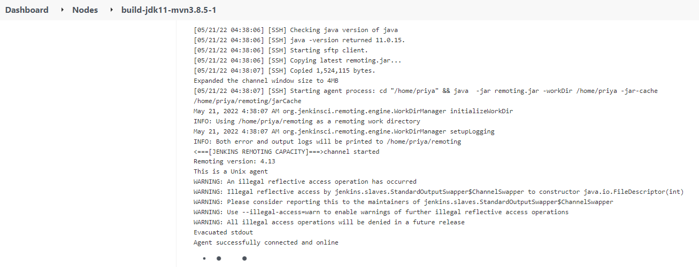
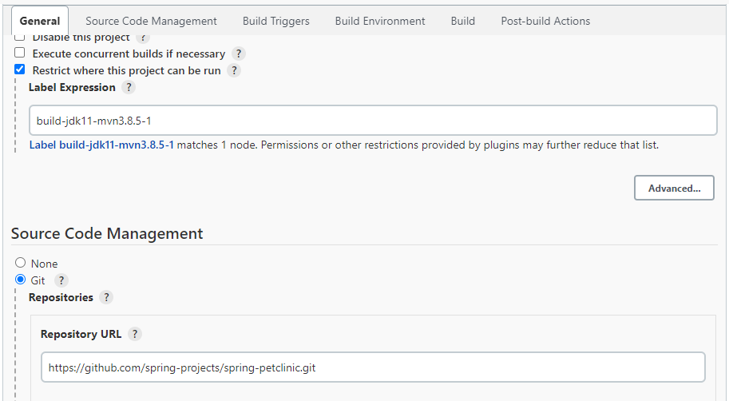
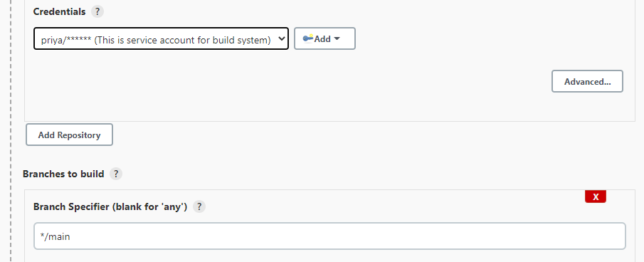
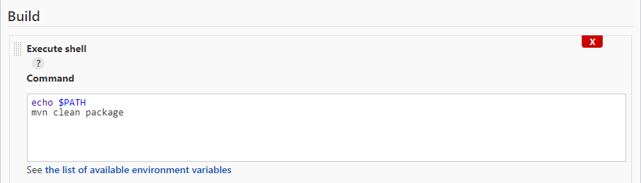
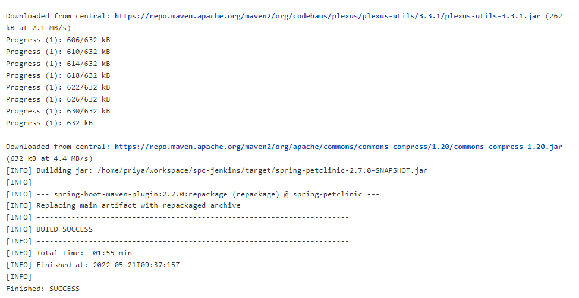

* After installing jenkins, Creating Admin User
  

* Jenkins setup
  

* Adding user in master node 
  

* Adding user in node 1
  

* Installed java and maven in user "priya"
  

* Ensuring java and git is installed or not
  

* Launching Agent
  

* Creating a Jenkins job to build spring petclinic for every hour in the Free style project 

  

  

  

  

  


### Creating a Jenkins job to build spring petclinic for every hour by Scripted pipeline:

```
//Scripted Pipeline
node('build-jdk11-mvn3.8.5-1') {
    stage('git') 
    {git 'https://github.com/GitPracticeRepo/java11-examples.git'}
    stage('build') {
        sh '''
            echo "PATH=${PATH}"
            echo "M2_HOME=${M2_HOME}"

        '''
        sh '/usr/local/apache-maven-3.8.5/bin/mvn clean package'
    }
    stage('archive') {
        archiveArtifacts artifacts: 'target/*.jar', followSymlinks: false
    }
    stage('publish test reports') {
        junit '**/TEST-*.xml'
    }
}
```
* Configuring required options
  

  
  
  

* After setting up required parameters, clicking on build now
  

* Pipeline steps
  

  

### Creating a Jenkins job to build spring petclinic for every hour by Declarative pipeline:

```

```
